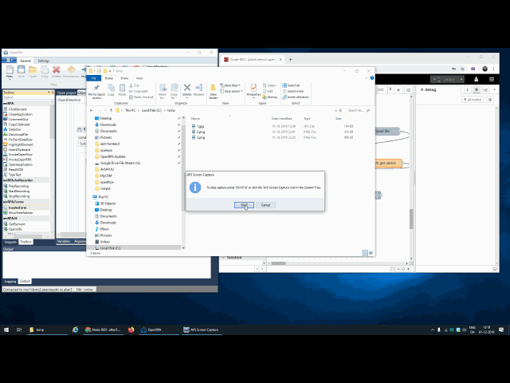

# OpenRPA
Open Source Robotic Process Automation Software

    

Download and try it out here [💾here](https://github.com/open-rpa/openrpa/releases/latest/download/OpenRPA.msi) and manage your [🔧OpenFlow account here](https://app.openiap.io)

Join our [🤷💻🤦 Community Forum](https://bb.openiap.io/) for for help or giving feedback 

Join our [💬 community](https://rocket.openiap.io/) for for help or giving feedback 

Click here for [💲🤷Commercial Support](https://openrpa.dk/)

Check out the [📘documentation](https://docs.openiap.io/) or knows issue and old documentation on our [❔wiki pages](https://github.com/open-rpa/openrpa/wiki)

Also checkout OpenFlow, the "backend" for managing multiple robots at [OpenFlow](https://github.com/open-rpa/OpenFlow)

Excel and browser interaction, used for vat number lookup

Automate creating contacts in CRM app from excel list

Support for high density robots, running multiple robots in each own remote desktop session

Easy Object detection in images using robot, OpenFlow and google vision API

See a small video of running the robot for the first time

