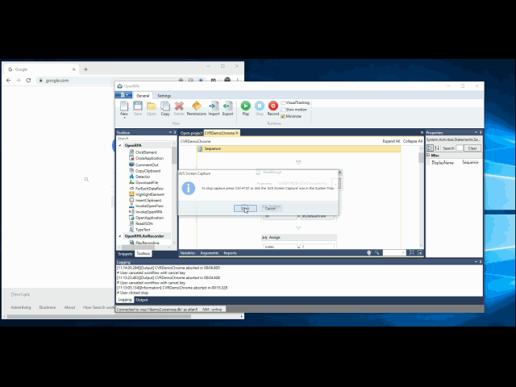
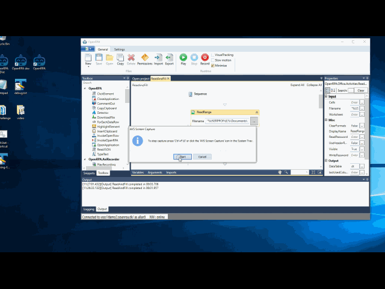
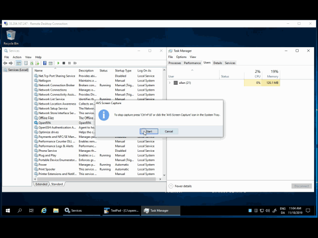

# OpenRPA
Open Source Robotic Process Automation Software

Join slack for for help or giving feedback [#openrpa](https://join.slack.com/t/openrpa/shared_invite/enQtNjI2ODE5NDIzNDg5LWI4YjFhZDI2OGJmZjA2MTNmNjNkZDRkMWU3MjgzMzY3NGM4MzI0OTFhY2Y2YzJlYmY4MTQzYWU1NGRhYmMxNmI)

Check out the documentation on our [wiki pages](https://github.com/open-rpa/openrpa/wiki)

Download and try it out here [here](https://github.com/open-rpa/openrpa/releases) 

Also checkout the "backend" for managing multiple robots at [OpenFlow](https://github.com/open-rpa/OpenFlow)

Excel and browser interaction, used for vat number lookup

Automate creating contacts in CRM app from excel list

Support for high density robots, running multiple robots in each own remote desktop session

See a small video of running the robot for the first time

