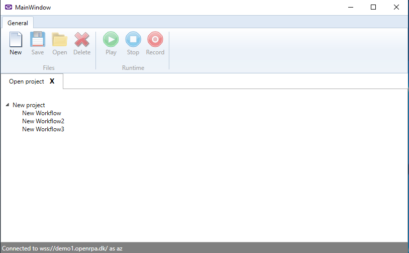
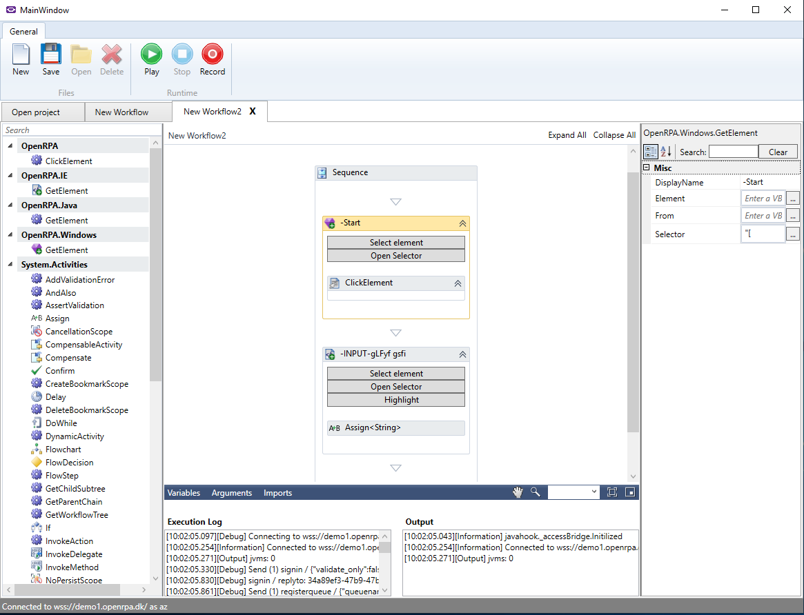
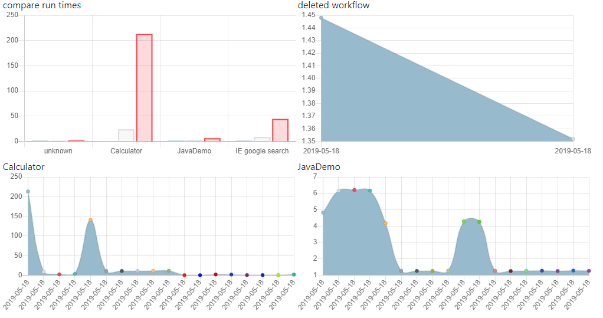
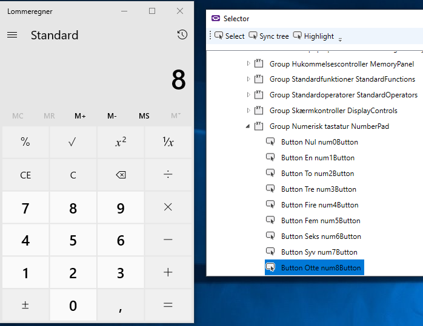
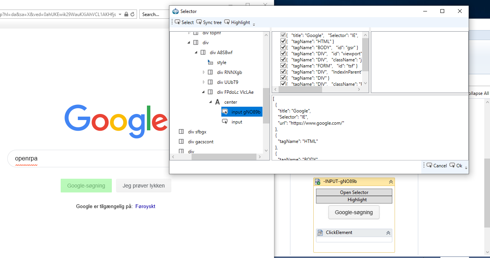
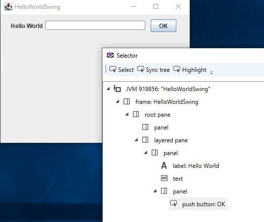
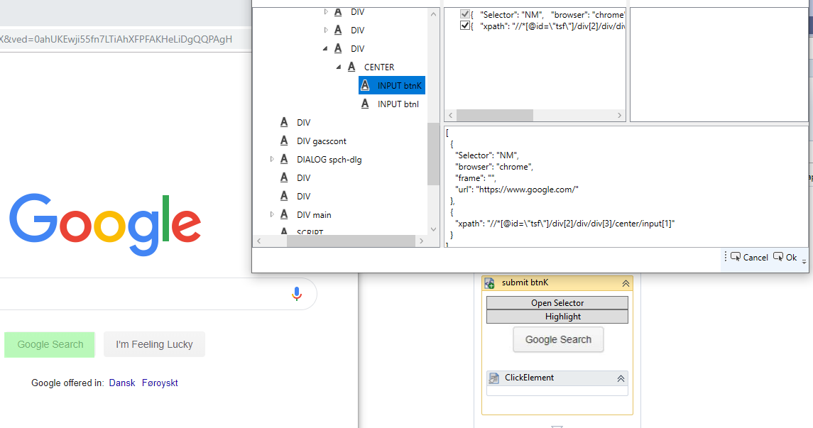

RPA solution under active development.

Supports running "stand alone" with state, projects and workflows saved localy ( ideal if used on machines without internet )

Easy manipulation of workflows using Microsoft Workflow Foundation, implemented the right way, saving state either localy or in OpenFlow.

Supports remote management, and remote handling of state, projects and workflows, using OpenFlow.
OpenFlow can initiate workflows on robots and robots can initiate workflows in OpenFlow
Robots have easy access to save any data and files centrally, all protected with access control lists, and support for EAS 265 bit encryption

For shedulering and central management of state and workflows, graphs and more have a look at [OpenFlow](https://github.com/open-rpa/OpenFlow)

For now, the robot supports 

Windows Components

Internet Explorer Components

Java Components

Chrome/Firefox/Edge

Images and OCR comming soon

Join slack for for help or giving feedback [#openrpa](https://join.slack.com/t/openrpa/shared_invite/enQtNjI2ODE5NDIzNDg5LTFhMzRmMzJiNTYzMDU5OTAxOTA3ZTRiZjA1ZWQ4ZDViMzY5NmVmYTgyZDExNzhiOThkZjE0ZmY2OTMyZjVhNTQ)

Try out OpenRPA [here](https://github.com/open-rpa/openrpa/releases) 

Check out the code [here](https://github.com/open-rpa/openrpa) 

Try with central management using [OpenFlow](https://github.com/open-rpa/OpenFlow) here

