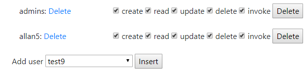
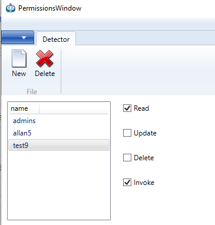

Open Source Robotic Process Automation Software

Join slack for for help or giving feedback [#openrpa](https://join.slack.com/t/openrpa/shared_invite/enQtNjI2ODE5NDIzNDg5LWI4YjFhZDI2OGJmZjA2MTNmNjNkZDRkMWU3MjgzMzY3NGM4MzI0OTFhY2Y2YzJlYmY4MTQzYWU1NGRhYmMxNmI)

Check out the documentation on our [wiki pages](https://github.com/open-rpa/openrpa/wiki)

Download and try it out here [here](https://github.com/open-rpa/openrpa/releases/download/1.0.81/OpenRPA.exe) 

Supports running "stand alone" with state, projects and workflows saved locally ( ideal if used on machines without internet )

Easy manipulation of workflows using Microsoft Workflow Foundation, implemented the right way, saving state either locally or in OpenFlow.

Supports remote management, and remote handling of state, projects and workflows, using OpenFlow.
OpenFlow can initiate workflows on robots and robots can initiate workflows in OpenFlow
Robots have easy access to save any data and files centrally, all protected with access control lists, and support for EAS 265 bit encryption

For shedulering and central management of state and workflows, graphs and more have a look at [OpenFlow](https://github.com/open-rpa/OpenFlow)

For now, the robot supports 

Windows Components

Internet Explorer Components

Java Components

Chrome/Firefox

Images and OCR

World class security using Access Control Lists and on-the-fly encryption for all objects in OpenFlow

Join slack for for help or giving feedback [#openrpa](https://join.slack.com/t/openrpa/shared_invite/enQtNjI2ODE5NDIzNDg5LWI4YjFhZDI2OGJmZjA2MTNmNjNkZDRkMWU3MjgzMzY3NGM4MzI0OTFhY2Y2YzJlYmY4MTQzYWU1NGRhYmMxNmI)

Check out the documentation on our [wiki pages](https://github.com/open-rpa/openrpa/wiki)

Download and try it out here [here](https://github.com/open-rpa/openrpa/releases/download/1.0.81/OpenRPA.exe) 

Try with central management using [OpenFlow](https://github.com/open-rpa/OpenFlow) here

