# OpenApplication

**What:** The basic idea behind this activity, is to make it easy to check for a running application, and launch it, if it is not. At the time of writing this, the activity supports Windows components, Internet Explorer and NativeMessaging (chrome/Firefox)

**How:** Click any running application/webpage and a selector for that application will be created. To fine tune, click Open Selector and make your modifications (like what elements to look for) To test the selector is working, click Highlight.
Clicking "Select element" will try and find the position of the window, and save it in x,y,width and height. It will then reposition and resize the window to match that every time it gets called.

**Why:** Use it instead of clicking though the start menu or opening files directly. The selector will include details like parameters, so if you opened word by clicking a document, the selector will detect that too.

# CloseApplication

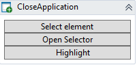

**What:** Close an application or webpage

**How:** Click any running application/webpage and a selector for that application will be created. To fine tune, click Open Selector and make your modifications (like what elements to look for) To test the selector is working, click Highlight

**Why:** Use it instead of clicking the close button. Can be handy if the application some times hangs, or you just want an efficient way of forcing an application to close.

# HighlightElement

**What:** Highlights a found element.

**How:** Drag this inside a GetElement activity, to highlight it. The workflow will continue while highlighting, to block the workflow from running while highlighting, set Clicking=True

**Why:** Use for debugging, or use it to make nice effects while the robot is running.

# TypeText

**What:** To assign a value you generally should use the Value property on item's, but if you need to send a Key combination to an application, this is your friend. 

**How:** I strongly recommend using the Record function to use this, but in case your interested in understanding the syntax, you can [read more here](typetext-syntax.md).

**Why:** Sometimes its just easier/faster to use a short cut key, or if the element will not receive the input properly.

# ClickElement

**What:** Represents a mouse click, the default is using virtual clicks. This means different things depending on the object type and provider, but generally you can think if it as a click without moving the mouse. Set VirtualClick to False, to do a real Mouse Click and then use OffsetX/OffsetY to make the click hit within the element (0,0 will be the top left corner of the element)

**How:** I strongly recommend using the Record function to use this, but if you drag this inside an GetElement activity remember to set the Element property to item.

**Why:** Clicking is needed, not everything can be done using shortcut keys.

# GetElement

**What:** The primary tool of the robot, used for locating items in the environment. Depending on the provider the settings may differ, but generally this can be used to locate one or many elements based on a selector. Use Open Selector to fine tune what you want. Per default, we will only find 1 item, and throw an error if we find less than one object. Use MaxResults and MinResults to change this behaviour. 
For instance if you want to loop though a DataSet you could select the DataRow and set MaxResults to 100. Then within the GetElement you add new GetElement to "pick" different elements per DataRow.
Setting MinResults to 0, effectively means your only checking if an object exists, but is not throwing an error, if nothing is found

**How:** Either press Record and click an element, the robot will try and figure out what type of element you clicked and insert the appropriate GetElement activity, or you can drag one in your self and use Open Selector to precisely select the element your interested in.

**Why:** Without elements, it's not really RPA 

# ForEachDataRow

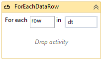

**What:** Many activities return a data table or dataset, and looping though that, can be a little bit of a hazel, since it does not have an easy accessible enumerator. Here, you 

**How:** Just type the name of the table and everything in the body will be called once, for row.

**Why:** Saves time, from having to setup an ForEachWithBodyFactory and writing a Linq query with an enumerator, or adding a the System.Data.DataSetExtensions namespace to get access to the AsEnumerable() extension method.

# GetImage

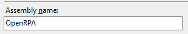

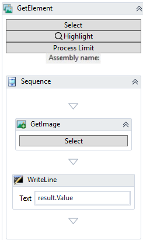

**What:** Get an image relative to another element.

**How:** Place GetImage inside an GetElement, and select a placement to grab, relative to the objects found.

**Why:** Image you want to ready the assembly name, using images, you open properties on the project find the label for the field, and then in GetImage select the field with the value. Now you can easily grab the value using OCR ( .Value will use OpenCV OCR)

# GetText

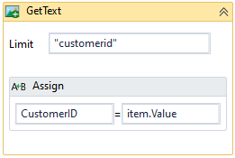

**What:** Get all text from an image using [OpenCV](https://opencv.org/).

**How:** Place GetText inside **any** GetElement or GetImage and gettext will get the text from the image using OCR, using the language selected under the Settings. To filter the results to a specefic word or sentence you can set WordLimit. Each result has coordinates and and a image, to be used by other activities, like elementclick, highlight etc.

**Why:** Instead of searching for a specific picture you can use GetText to find elements in a picture, useful for automating in RDP/Citric/Teamviewer or games/paints etc.

# LoadFromFile

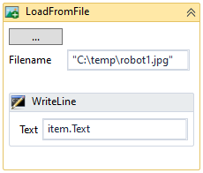

**What:** Load an image file, and returns an ImageElement

**How:** Just select the file, and set Result to a variable of type ImageElement, or reference item inside the body.

**Why:** Sometimes you may need and image from a file, not something currently present on the screen, for instance doing OCR on the image, or searching for something dynamicl

# TakeScreenshot

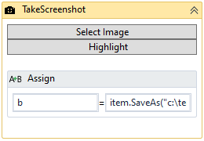

**What:** Takes a picture of either the whole screen, and element or a specific area of the screen.

**How:** This activity almost works exactly like GetImage, except it also supports being used outside an GetElement, to take images of the desktop or a specific area.

# CommentOut

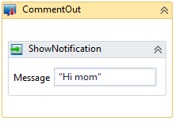

**What:** Comment out parts of a workflow, so it will no longer be executed

**How:** Either drag'n'drop or copy'n'paste activities inside, or use the right click menu for commenting out parts of a workflow. ( only works inside sequences ) 
To Comment out multiple activites: Mark the activities and choose "Comment out" This will move the two activities into a new sequence that can later be "Uncommented"

**Why:** Useful when you want to save parts of a workflow but don't want it to run.

# CopyClipboard

**What:** Copy the content of the users clipboard, either an image or string content

**How:** Just drop it in, and it will copy the content. Set "SendCtrlC" to copy what is marked right now

**Why:** Sometimes it's more handy to copy using clipboard than reading directly from an element, for instance when automating though RDP/Citrix/Teamviewer 

# InsertClipboard

**What:** Insert a text string into the users clipboard

**How:** Just drop it in and set the text in Text

# MoveMouse

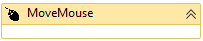

**What:** Move the mouse to a specific location

**How:** Either use within an GetElement and OffsetX, OffsetY will be relative to that item, or remove the item variable and OffsetX, OffsetY will be on desktop 1

**Why:** One example would be menu's you can only open with mouse over but not click. 

# Detector

**What:** Make workflow wait for an detector to be triggered

**How:** Drag it onto your workflow, and select a detector from the dropdown menu. When the workflow is running, when it gets to this activity the workflow will go idle and wait until the selected detector gets triggered. ( state is saved, so if the robot or the machine is rebooted, the workflow will continue from this activity )

**Why:** This is an excellent way to make a workflow react to things in the environment. You could make a workflow that helps filling in information into a form when the user presses a specific keyboard combination, or you would show a helpful dialog, when ever a user opens a Timesheet, or maybe you want to add extra actions to an existing button. 

Note, as soon as an activity has been created, all actions will also be sent to OpenFlow.
You can use OpenFlow to trigger other robots based on a trigger ( or interact with one of the more than 2000 different systems supported )

# InvokeOpenFlow

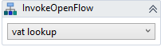

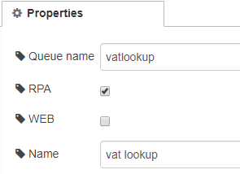

**What:** Call a workflow inside OpenFlow

**How:** Insert a workflow node inside OpenFlow, check RPA to make it visible to robots and click deploy. Now you can select this workflow inside the InvokeOpenFlow activity inside OpenRPA. All variables in the workflow will be sent to the workflow in msg.payload, and any data in msg.payload will be sent back to the robot once completed, if a corresponding variable exists.

**Why:** Greatly improves to possibilities in RPA workflow, by giving access to other robors and more than 2000 other systems, using an easy to use drag and drop workflow engine.

# InvokeOpenRPA

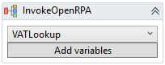

**What:** Call other workflow in OpenRPA

**How:** Drag in InvokeOpenRPA and select the workflow you would like to call. Any arguments in the targeted workflow will be mapped to local variables of the same name, to support transferring parameters between the two workflows. Click "Add variable" to have all the in and out arguments in the targeted workflow created locally in the current scope/sequence.

**Why:** More complex workflows is easier to manage if split up to smaller "chucks" that call each other. Having multiple smaller workflows also give easy access to run statistics on each part of the workflow using OpenFlow.

# InvokeRemoteOpenRPA

**What:** Call a workflow on a remote robot, or group of robots.

**How:** Just select the robot or role you want to send the request to, and the list of workflows will limit it self to what ever that robot or role have access too. If the workflow takes or returns arguments clicking "Add variables" will add a variable for each for those to the current sequence.

**Why:** Easier than having to add an OpenFlow workflow to handle calling the robot. It's always more secure to use OpenFlow to handle multiple robots, but sometimes its nice to have a fast easy way, to get something done on multiple machines.

# InsertOne

**What:** Take any object and convert it to a Json document and saves it in the database if connected to an OpenFlow instance.

**How:** Set object to save in Item, override document type using the Type field, use Encrypt Fields to define what elements of the document to encrypt with EAS 256bit encryption. Result contains the result of the insert.

**Why:** Easy way to save and work with data across domains/multiple robots or use it as a convenient database.

# InsertOrUpdateOne

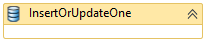

**What:** Take any object and convert it to a Json document and saves it in the database if connected to an OpenFlow instance. 

**How:** Works just like InsertOne. 
Using Uniqueness you can define a custom unique constraint when inserting or updating. Say you have an object with an property "department" and you know all departments have an unique name. instead of manually testing if the object already exists you can use InsertOrUpdate and set type to "department" and Uniqueness to "department,_type" ( type is saved as _type in the database). If Uniqueness is not supplied the default constrain of using _id is used.

**Why:** Easy way to save and work with data across domains/multiple robots or use it as a convenient database.

# DeleteOne

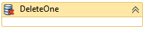

**What:** Delete an document from the database in OpenFlow

**How:** Either supply the object in item or the ID in _id

**Why:** Easy way to save and work with data across domains/multiple robots or use it as a convenient database.

# Query

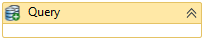

**What:** Search the database in OpenFlow.

**How:** Supply an [MongoDB query](https://docs.mongodb.com/manual/tutorial/query-documents/) in QueryString and get result as a array of [JObjects](https://www.newtonsoft.com/json/help/html/T_Newtonsoft_Json_Linq_JObject.htm) in result

**Why:** Easy way to save and work with data across domains/multiple robots or use it as a convenient database.

# GrantPermission

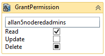

**What:** Grant permissions for a user or group to an object.

**How:** Using the resulting JObject from one of the other activities, you can update the _acl property ensuring a specific user or group a specific set of permission ( either set, ignore or remove read, update and delete for the user/group). After this, you must save the changes using InsertOrUpdateOne

**Why:** Easy way to save and work with data across domains/multiple robots or use it as a convenient database.

# RemovePermission

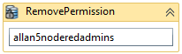

**What:** Remove permissions for a user or group to an object.

**How:** Completely remove the permissions for a specific user or group on the given JObject.

**Why:** Easy way to save and work with data across domains/multiple robots or use it as a convenient database.

# SaveFile

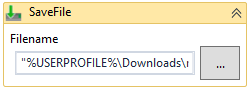

**What:** Upload a file to [GridFS](https://docs.mongodb.com/manual/core/gridfs/) in the database in OpenFlow.

**How:** Uploads a file to OpenFlow, can be downloaded again using GetFile, updated using InsertOrUpdateOne and  deleted using RemoveOne 

**Why:** Easy way to save and work with data across domains/multiple robots or use it as a convenient database.

# GetFile

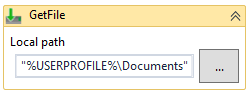

**What:** Download a file from [GridFS](https://docs.mongodb.com/manual/core/gridfs/) stored in the database in OpenFlow.

**How:** Download a file again using either _id or get the latest version based on the filename, if user has access.

**Why:** Easy way to save and work with data across domains/multiple robots or use it as a convenient database.

# SetCredentials

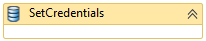

**What:** Save a username and password with a name.

**How:** Just find a name for your credential set, and set username and password,

**Why:** For easy access to updating credentials from the robot

GetCredentials

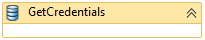

**What:** Gets credentials by name from OpenFlow

**How:** Set name, and save username and password in variables, if you cannot use SecureString use UnsecurePassword to save the password in a string variable instead.

**Why:** It's not good practice to keep username and passwords in a workflow, so is more safe to save the them inside OpenFlow where username and password will be encrypted.

# SetAutoLogin

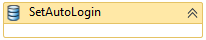

**What:** Set auto login information for current computer.

**How:** This will only work if robot is running with admin privileges. Forces the computer to automatically login with the given credentials at next reboot. Will work for ever is count is set to 0. 

**Why:** This is a better alternative than setting username and password in clear text in registry, this activity will save the password in the local lsaStore 

# ReadCell

**What:** Read a single cell in an excel spreadsheet. Type of data is selected in the ArgumentType dropdown list.

**How:** Can be added doing recording by pressed esc when clicking inside excel or manually dragged into a workflow. Select the type of data your reading, select the cell to read from in the Cell property for instance "A2" and set the receiving variable in the Result property. To force excel to read from the correct Sheet, also set the worksheet property.

**Why:** Classical RPA technologies can have a hard time working with application that does a lot of UI manipulation doing run time, such as Microsoft Excel, so using Office COM interfaces is more convenient. It also offers more options, like reading the formula or the value etc.

# WriteCell

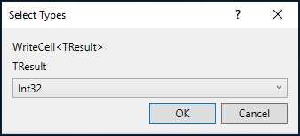

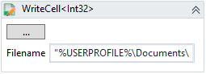

**What:** Write a value into an excel spreadsheet. Type of data is selected in the ArgumentType dropdown list.

**How:** Can be added doing recording by typing a value in the input dialog when clicking inside excel or manually dragged into a workflow. Select the type of data your reading, select the cell to write in too the Cell property for instance "A2" and set the value/variable in the Value property. To force excel to read from the correct Sheet, also set the worksheet property. Use Formula if you want excel to calculate the field instead of just adding the value.

**Why:** Classical RPA technologies can have a hard time working with application that does a lot of UI manipulation doing run time, such as Microsoft Excel, so using Office COM interfaces is more convenient. It also offers more options, like reading the formula or the value etc.

# ReadRange

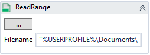

**What:** Read several cell or a whole sheet into a DataTable. Can also be used to easily find next empty cell using LastUsedColumn and LastUsedRow

**How:** Drag a ReadRange in and select the spreadsheet to open. To force a specific sheet, fill in Worksheet property. Set the range to read in Cells property and the receiving property in "DataTable" property

**Why:** Classical RPA technologies can have a hard time working with application that does a lot of UI manipulation doing run time, such as Microsoft Excel, so using Office COM interfaces is more convenient. It also offers more options, like reading the formula or the value etc.

# CloseWorkbook

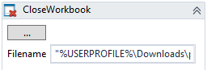

**What:** Close a workbook if open in excel.

**How:** Select a file, and if that file is currently open it will be closed, will saving any changes to the workbook if the workbook is not readonly.

**Why:** Classical RPA technologies can have a hard time working with application that does a lot of UI manipulation doing run time, such as Microsoft Excel, so using Office COM interfaces is more convenient. It also offers more options, like reading the formula or the value etc.

# GetEmails

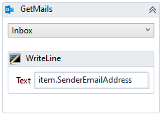

**What:** Get all emails from a folder in a running outlook.

**How:** Select a folder in the dropdown menu, set UnreadOnly if you only need to process new emails.

**Why:** Classical RPA technologies can have a hard time working with application that does a lot of UI manipulation doing run time, such as Microsoft Excel, so using Office COM interfaces is more convenient. It also offers more options, like reading the formula or the value etc.

# NewEmailItem

**What:** Open and send a new email using Outlook.

**How:** Opens a new email using the currently running outlook session and sends it, if UIAction set to "Send" r wait for user to send/cancel or save the email when UIAction is set to "Show and wait".

**Why:** Classical RPA technologies can have a hard time working with application that does a lot of UI manipulation doing run time, such as Microsoft Excel, so using Office COM interfaces is more convenient. It also offers more options, like reading the formula or the value etc.

# CommentOut

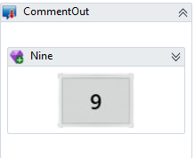

**What: **Comment out, lets you easily remove parts of a workflow. Anything you place inside CommentOut will not be executed.

**How:** Simply drag'n'drop or copy'n'paste activities into this activity. A right click option will soon be implemented for even faster adding and removing out commented code.

**Why:** While debugging it can be handy to remove small parts of an workflow, sometimes people also use it for template's.

# CopyClipboard

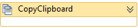

**What:** Copy what ever is in the clipboard, set SendCtrlC to true, to grab what ever is selected right now

**How:** After copying or marking text or an image, insert this activity and you get the result in StringResult or ImageResult

**Why:** Sometimes its just more convenient to use copy'n'paste, other times is the best way for instance when automating using Remote Desktop or Citrix, using OCR is not always reliable, so using copy'n'paste is better

# InsertClipboard

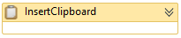

**What:** Adds text to the clipboard, ready to be pasted.

**How:** Just assign text to the Text Property.

**Why:** I don't know why, it just felt right, after creating CopyClipboard. Maybe you want to add a text, the user can then decide where to insert. 

# OpenURL

**What:** It is pretty much the same as OpenApplication, except it only supports Internet Explorer. 

**How:** Click Get current, to automatically fetch the URL of the active tab of first browser it finds.

**Why:** Not sure, OpenApplication should be good enough for now.

# ShowNotification

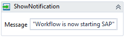

**What:** Show a small message in the notification area of the right bottom of the screen.

**How:** Set Message and select an notification type.

**Why:** Handy for giving the user feedback on status of the workflow

# InvokeForm

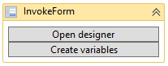

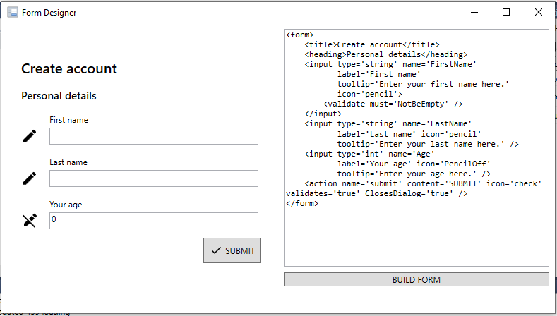

**What:** Display a form to the user, requesting user feedback

**How:** Click Open designer to design a workflow, you can find more information on the syntax on [Forge Forms](https://wpf-forge.github.io/Forge.Forms/) . Any variables matching a name in the form will be bound to that field, so if the variable has a value it will be show in the form, and once the user closes the form, the inserted values will be mapped to the variables. For easy creating the variable of the correct type, click "Create variables" once the form has been designed in the designer. Result.Action will contain the name of the button the user pressed and null/Nothing if canceled.

**Why:** Handy for creating user interaction in the workflow

# InvokeCode

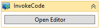

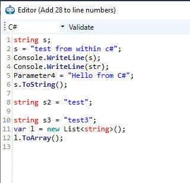

**What:** Allows you to write code in a couple of different languages. 

**How:** Drop in the activity, and click Open Editor. This will copy the list of namespaces currently imported and save it (used when executing the code). In the drop down list select you preferred language, if you choose VB or C# you will also get IntelliSense while writing code. If you get an error executing the code, you will get a line number, to find the same line in your code, you need to substract the number of lines show in the title. So if you get an error on line 32 and the title say add 20 lines, the line that had the error will be line 12

**Why:** Workflows are cool, but sometimes it is just more efficient or convenient to write a couple of lines of code in a familiar language.

# DownloadFile

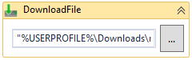

**What:** Download a file to the local machine.

**How:** Set URL and select a folder and filename to save as. If overwrite is false and the file exists, the file will not be downloaded again.

# ReadExcel

**What:** Reads an excel or CSV file, and returns a dataset while all the data. 

**How:** Supply a filename, set weather first row should be treated as Header and a DataSet variable. If reading an excel file, each Worksheet will be added as a new table.
You can use ForEachDataRow to loop though the data using .table(0) if you have multiple worksheets you can also get the table by name like .table("Sheet1")

**Why:** Useful if you are on a computer without a newer office installed, or you don't want excel to open while reading the data.

# WriteExcel

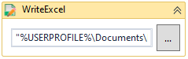

**What:** Write a data table or data set to a new excel file

**How:** Supply a filename and a data table or data set. This will overwrite the file, and this will remove any calculations or formatting. To include a header, set include header to true. You can have the data formatted a little better by selecting one of the built in themes.

**Why:** Good alternative if a newer office is not installed, or if you don't care about layout and formulas.

# ReadJSON

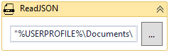

**What:** Read a simple JSON structure or array, into a data table for easy parsing.

**How:**Supply a json file, and a datatable variable and use ForEachDataRow to loop though it

**Why:** An alternative to creating JObject/JArray and parse it your self 

# ReadPDF

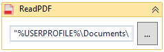

**What:** Read a PDF file

**How:** Supply a pdf file, and either get all text as a string or parse it using the [PDFReader](https://api.itextpdf.com/iText5/5.5.11/com/itextpdf/text/pdf/PdfReader.html) object 

**Why:** Simple solution for basic PDF reading, use [AWS Textract](https://aws.amazon.com/textract/) or similar services for more advanced parsing, or [Abby](https://www.abbyy.com/en-eu/solutions/accounts-payable-automation) or [Rossum](https://rossum.ai/) or similar for invoice parsing.

