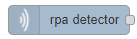
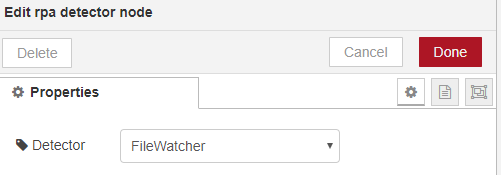
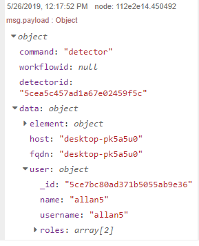
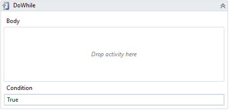
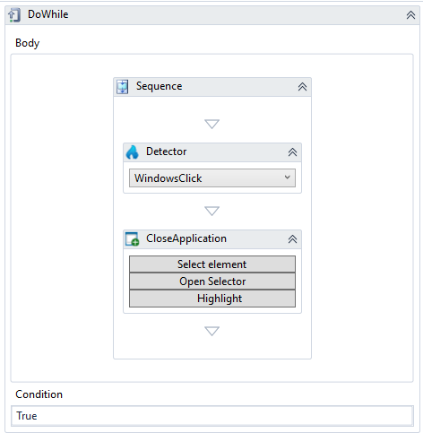

# Detectors

Workflows needs to be activated in some way. And opening the workflow and pressing Play is not always the best solution. Detectors is a way to make the robot serve as a detection probe for OpenFlow and/or as a way of activating Workflow locally on the robot machine. For instance, when implementing Assisted Robotics, where the robot will help a human at the PC, it would make a lot of sense to teach the users that pressing a certain key combination, for instance Ctrl+M will activate a robot sequence that does something, like copying the content of the select field, call an workflow in OpenFlow and insert data in the form, based on the result. Another common detector is the FileWatch detector. Setting op a job that monitors a folder for CSV files, and processes them, once a new one arrives, is easy.

## Setting up detector

Pressing Detectors in the toolbar will open a list of detectors you have access too, at the top will be a list of the currently installed detector plugins, clicking one of these will add a new Detector. Select a detector and press the Delete key on your keyboard, to remove a detector. Depending in the detector you will get a list properties and buttons. For instance, the 2 Windows Detectors have a Select button, and the option to finetune the selector by clicking Open Selector.

As soon as the detector is added, it becomes active, and you will be able to listen for Detector events inside OpenFlow, or use the detector in local workflows.

## Using a detetor

There a  main uses for detector. Listening for events from Openflow to react on robot computer events, or inside running workflows. Once a detector have been added it will be visible inside OpenFlow. Just drag in a detector node, and select the new detector from the drop down list

Everything that follows will be executes every time the detector is triggered. If permissions on the trigger allows several robots access, all of them will trigger this Node. 
By inspecting msg.payload.data.host or msg.payload.data.user.username you can figure out where the detector was triggered from

Another way to use detectors is from local workflows. Lets say you created a click detector that reacts on a user clicking the Help menu item in Notepad. Now create a new workflow and add a DoWhile activity and set Condition to true. We want the workflow to run for ever, since the workflow will end once it reaches the end. By keeping the detector and other code inside a never ending loop, we can make sure the workflow keeps running, and triggers every time the detector triggers.

Now, we add the detector activity and select the detector you had just created, and right after that you add a CloseApplication activity. Click "Select"´in the CloseApplication activity and click anywhere in a running notepad, to show, this is the application we want to close.

Now press Play, and try clicking the Help menu item and enjoy how helpful this workflow is .

## Keyboard detector

Used to monitor for a sequence of keys. Simply click "set keys" and start pressing the keys in the EXACT sequence, when done, press "OK" to set the new sequence.