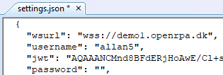
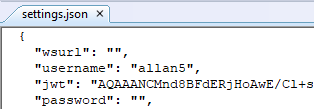

## "Offline" mode

OpenRPA was made to work in tandem with OpenFlow, but it can work in a standalone mode where it does not need to be connected to an OpenFlow instance, but then you loose all the benefits from OpenFlow.

Make sure the robot is not running, then open the file settings.json inside "Documents\OpenRPA"

Find the wsurl property and remove the current URL

So it looks like this

Be aware, if you re add an URL here, you need to manually import all workflows and detectors, so, create a copy of the OpenRPA folder after adding the URL and then import each workflow and detector from that folder