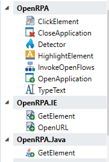

The main idea is to make an extensible robot. By giving other developers access to easily create the functionality that is needed, hopefully the whole community can benefit (if published as open source too, you don't need to) and increase the use cases for the robot. There are currently 4 different ways you can extend the functionality of the robot

## New Script Activities

Please go to: [script-activities](plugin-of-script-activities)

## New activities

You can extend the toolbar in the robot to include new activities besides those that came with the robot

The robot uses Microsoft Workflow Foundation ( .NET version 4.6.2 ). A lot of different products uses this platform ( even other RPA products, for instance UIPath), and in many cases activities created for one platform will also work here. Say someone created an activity that reads the content of a PDF file and inserted that into a string, that activity would most likely also work inside OpenRPA.

There are many very good resources on the web on how to create activities, [like this one](https://docs.microsoft.com/en-us/dotnet/framework/windows-workflow-foundation/how-to-create-an-activity).

You can also find community developed general purpose activities. 

When you found or developed one, just place the dll inside the directory with the robot binaries, (or install the dll in the Global Assembly Cache (GAC)) and the robot will automatically load them, doing startup

## New Detectors

If you want the ability to activity a workflow by some external trigger, you can create a new detector. An example could be a detector that monitors an SQL server for new records and raises an event, or you could create a tool that checks for new orders in your ERP system and raises an event when that happens.

Create a new class and implement the IDetectorPlugin interface. 

- Initialize gets called once doing startup for every instance of your detector that has been created
- Name is what identifies your detector, so keep this static
- Entity is the data object that you use for saving any data that is needed for configuring and running you detector ( this gets saved when editing the addon only )
- OnDetector is the event you must invoke, when ever you detected something
- Start gets called doing initialize, but can/will also be called after events that need to stop all detectors (like when recording)
- Stop gets called when you need to stop monitoring/sending events
- editor must return a WPF UserControl where you can define how users can configure your detector. Please implement INotifyPropertyChanged on this user control, since the robot uses this to detect changes that needs to be saved.

## Recording plugin

When the robot starts, it will create an instance of all the classes it can find that implements IRecordingPlugin. When the user clicks Record, every time he/she does a mouse click the robot first finds the AutomationElement that was clicked, it then create an GetElement activity and a WindowsSelector for locating this Element. Next it loop though all the recording plugins and call parseUserAction with the information. Each addon can then "claim" the event and decide to use its own activities and selectors for getting the element. How you decided if an element is yours is up to you, but a common pattern would be to check the name of the process or check the ClassName.

Implementing a plugin is a little more complicated. that the above two.

We start by creating a classes and implement IRecordingPlugin

* Name is what identifies your plugin, so keep this static
* Status can return a short message identifying to the user if you are ok.
* Initialize gets called once doing startup
* Start will get called when the robot wants to find only your type of elements. ( for instance if you click "select" in the Selector Window, we call Start )
  You send back clicked elements invoking the OnUserAction event.
* Stop gets called when we no longer need you to raise OnUserAction 
* parseUserAction gets called every time a user does a click doing recording, and  you can update the referenced IRecordEvent if you think your addon is better at handling a click on the given element. Make sure you override AddInput function if your element supports input (indicated by setting SupportInput to true )
* OpenApplication will call LaunchBySelector
* CloseApplication will call CloseBySelector
* GetRootElements is used by the Selector Window when opening. If used in a nested GetElement activity, anchor will contain the parent selector, you should then restrict your results from the anchor
* GetSelector must return a selector for the element from treeelement item. Filter out selectorItems that is already used if anchor is not null
* Match is used in the Selector Window, when syncing the tree (finding the target element in the tree)
* GetElementsWithSelector is what is called when ever we want to find one or more elements using your selector. ( for instance when clicking highlight )

When you are parsing parseUserAction , or returning a new class that implements IRecordEvent

* UIElement is the element originally found by with Window plugin, do NOT override this.
* Element must bet set with your implementation of IElement when claiming an event
* Selector must bet set with an instance of your Selector when claiming an event
* a body must be set to an instance of IBodyActivity when claiming an event
* set SupportInput to true if you want the robot to prompt for input and call IBodyActivity .AddInput
* If you don not want the robot to handle clicking the element, set ClickHandled to true ( you must then click the element )

When raising IRecordingPlugin.OnUserAction or parsing IRecordingPlugin.parseUserAction you need to return an element implementing IBodyActivity

* You should create an Activity called GetElement that has an Selector InArgument and supports IActivityTemplateFactory. Create a new instance of this GetElement activity and assign it to IBodyActivity.Activity. The robot will then try to add a ClickElement activity inside your body using AddActivity. 
* If SupportInput was true and user gave input, the robot will call AddInput, Normaly you would then replace the body with an Assign that sets Item.Value to the user supplied text

If UIElement does not cover the needs for your specific plugin you can implement your own Element class by implementing IElement, add any property and methods you like, but for basic robot functionality you must implement

* RawElement a placeholder for the raw element used for creating the IElement
* Value should return what a user would considerer the primary value for the element, and support setting if it can be updated ( supports input )
* Focus should place the cursor in the element
* Click for clicking the element
* Highlight for highlighting the element on screen, OpenRPA.Interfaces.Overlay.OverlayWindow has a easy to use way of highlighting the element
* ImageString should return a Base64 encoded Bitmap with a screenshot of the Element, no more than 300x100 pixels

Now, all you need to do is create the Selector and tree functionality, keep in mind all classes will be serialized as JSon.

* Inherit the OpenRPA.Interfaces.Selector.treeelement class that is used to represent an element is the Selector window Tree.

* Inherit the OpenRPA.Interfaces.Selector.Selector class that represents a selector for finding an element. It is a list of Selector Items, each item representing an item in the UI tree

* Inherit the OpenRPA.Interfaces.Selector.SelectorItem class that represents a selector item. When not dependent on an anchor, make sure element 0 is a plugin specefik selector that MUST include an property of the name Selector with a value from IPlugin.Name

  

