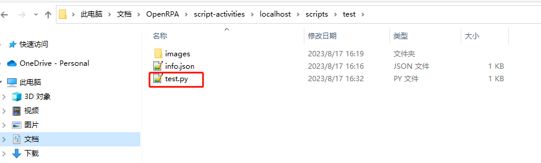
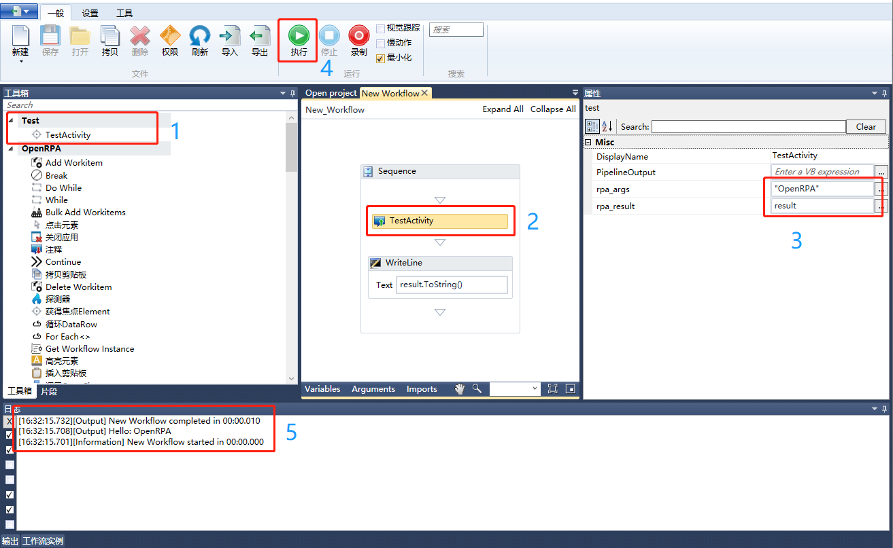
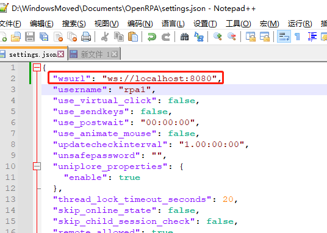
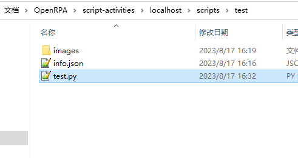
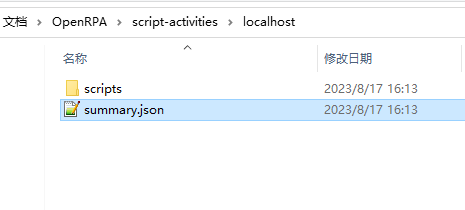
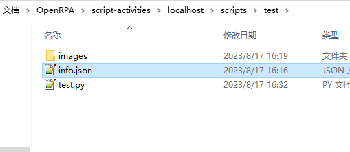
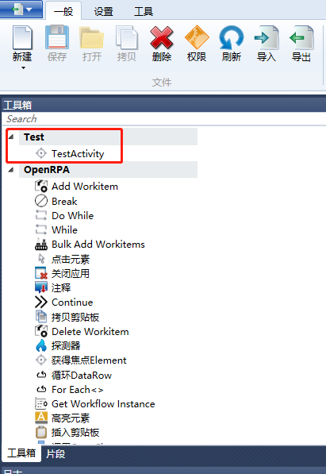

Convert scripts to dynamic instructions to quickly expand the capabilities of OpenRPA in the toolbox without writing C# or compiling dynamic libraries.

## Quick Show

1. Add `test.py` script, then relaunch `OpenRPA` client



2. Use the script activity instruction 



## Development Guide

### 1. Get the script directory
- Get the host from `wsurl`. It's `offline` for offline mode for which the `wsurl` is empty `""`.
  - The host is `localhost`, so the working directory (`WORK_DIR`) is `{OpenRPA configuration directory}/script-activities/localhost/`



### 2. Create the script
- Create `test.py` in directory `{WORK_DIR}/scripts/test/`
```python

print(f"rpa_args is: {rpa_args}")
rpa_result = f"Hello: {rpa_args}"

```


### 3. Create or edit the config
- Create `summary.json` in directory `{WORK_DIR}/`
```json
{
  "items":[
    {
	  "categoryName": "Test",
	  "moduleName": "TestModule",
	  "enable": true,
	  "scripts":[
		{
			"enable": true,
			"dirName": "test"
		}
	  ]
	}
  ]
}
```


- Create `info.json` in directory `{WORK_DIR}/scripts/test/`
```json
{
     "activities": [
          {
               "language": "python",
               "name": "test",
               "displayName": "TestActivity",
               "fileName": "test.py",
               "toolboxIcon": "images/test-icon.png",
               "designerIcon": "images/test-icon2.png",
               "tooltip": "This is a test script activity"
          }
     ]
}
```


### 4. Use the script activity
- After relaunch the OpenRPA client, the dynamic script activity should appear in the toolbox. Enjoy yourself !



## Documentation

`Notice`: Only test for python

### 1. `rpa_args`
Input Argument of the dynamic activity, the recommended input argument types include deep attrs is primitive types(int,float,bool,string), JObject, JArray, IDictionary, IList, etc.

- If the runtime is python, `JObject` or `IDictionary` will be converted to `python dict`, `JArray` or `IList` to `python list`

### 2. `rpa_result`
Output Argument of the dynamic activity, the recommended output argument include deep attrs types: primitive types(int,float,bool,string), list, dict, etc.

### 3. `summary.json`
- Location of the config file: `{OpenRPA configuration directory}/script-activities/{host}/summary.json`
  - OpenRPA `settings.json` configuration may locate in `{Windows Documents Dir}/OpenRPA/settings.json`
- Format of the config file:
```json
{
    "items": [
     {
         "categoryName": "CategoryName",
         "moduleName": "UniqueModuleName",
         "enable": true,
         "scripts": [
           {
             "enable": true,
             "dirName": "test"
           }
         ]
     }
    ]
}
```
- Description of the config:
  - `items` Array of script instruction modules
  - `items[].categoryName` The category name in the OpenRPA toolbox
  - `items[].moduleName` The `c#` runtime dynamic module name, it has to be unique
  - `items[].enable` Whether to enable the module
  - `items[].scripts` Array of scripts directory
  - `items[].scripts[].enable` Whether to enable the scripts
  - `items[].scripts[].dirName` The scripts directory name. eg: `test`, `moduleA/test`

### 4. `info.json`
- Location of the config file: `{OpenRPA configuration directory}/script-activities/{host}/scripts/{dirName}/info.json`
- Format of the config file:
```json
{
     "activities": [
          {
               "enable": true,
               "requires": ["selemium==4.10"],
               "language": "python",
               "name": "test",
               "displayName": "测试",
               "fileName": "test.py",
               "toolboxIcon": "images/test-icon.png",
               "designerIcon": "images/test-icon2.png",
               "tooltip": "这是测试指令"
          }
     ]
}
```
- Description of the config:
  - `activities` Array of instruction activities
  - `activities[].enable` Whether to enable the script activity
  - `activities[].requires` Array of the dependencies for python. (`undeveloped`)
  - `activities[].language` The script type (`python`, `vb`, `c#`, `powershell`, `AutoHotkey`), and only the type of `python` has been tested
  - `activities[].name` The `c#` runtime dynamic activity name
  - `activities[].displayName` The displayed name of the dynamic activity
  - `activities[].fileName` The name of the script file. eg: `test.py`, `subdir/test.py`. (The absolute path of the script is: `{absolute dir of info.jso}/{fileName}`)
  - `activities[].toolboxIcon` The dynamic activity icon in OpenRPA toolbox
  - `activities[].designerIcon` The dynamic activity icon in OpenRPA designer
  - `activities[].tooltip` The dynamic activity tooltip message in OpenRPA toolbox

## TODO in the future
- process activities[].requires
- validate rpa_args
- show usage of each script activity
- `optional` load from remote (eg. OpenFlow)
- `optional` manage script activities