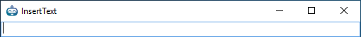

## Recording

You start recording by clicking the record button. The robots UI will minimize and every click you make will be caught by the robot. The robot will try and determine what is the best strategy for locating the element you clicked on, and insert an activity in the designer that matches. The robot will add activities under the current selected activity and/or inside the currently selected sequence. So recording only works inside sequences, if you select the background, or have a flow diagram or state machine selected, nothing will be added.

You stop the recording by clicking the cancel key (the escape key per default)

Each recording plugin have the option to detect if you click a input field. In that case the robot will prompt you for an value to insert into this field, instead of just clicking it

If you press the cancel key (Esc), the robot will revert back to adding a click for the element.

While recording the robot will also catch all keyboard presses, and add them to an Type Text activity, this will send the sequence of keys to windows when re-played. Keep in mind, this is not bound to a specific element, so if nothing has focus, the input might be "lost", try to always assign input using item.Value instead of Type Text, but for those cases when using a shortcut key is more handy, feel free to use it.

While recording, have patience. Do one click at the time, wait at least 1 second between each click to allow the robot to process your last click ( you might have noticed that every time you click the is a small delay, that is the robot working behind the scene )